## Table of Contents

- [要求二](#requirement-2)
- [要求三](#requirement-3)
- [要求四](#requirement-4)
- [要求五](#requirement-5)
- [要求六](#Optional-Requirement-6)

## Requirement 2
- 建立⼀個新的資料庫，取名字為 website。
```
show databases;
CREATE DATABASE website;
show databases;
```

   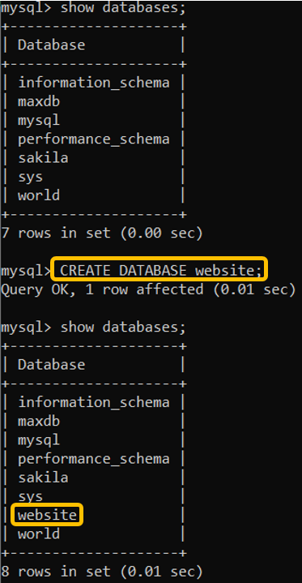

- 在資料庫中，建立會員資料表，取名字為 member。
```
CREATE TABLE member (
    id bigint PRIMARY KEY AUTO_INCREMENT,
    name varchar(255) NOT NULL,
    username varchar(255) NOT NULL,
    password varchar(255) NOT NULL,
    follower_count int unsigned NOT NULL DEFAULT 0,
    time datetime NOT NULL DEFAULT CURRENT_TIMESTAMP
);
```

## Requirement 3

- 使⽤ INSERT 指令新增⼀筆資料到 member 資料表中，這筆資料的 username 和 password 欄位必須是 test。接著繼續新增⾄少 4 筆隨意的資料。
```
INSERT INTO member(name,username,password)VALUES ("test", "test", "test");
INSERT INTO member(name,username,password,follower_count)VALUES ("May", "May", "abc54321",50);
INSERT INTO member(name,username,password,follower_count)VALUES ("John", "John56", "John5566",30);
INSERT INTO member(name,username,password,follower_count)VALUES ("Sally", "sally", "sallysally",30);
INSERT INTO member(name,username,password,follower_count)VALUES ("Chris", "Chris01", "12345",5);
```
   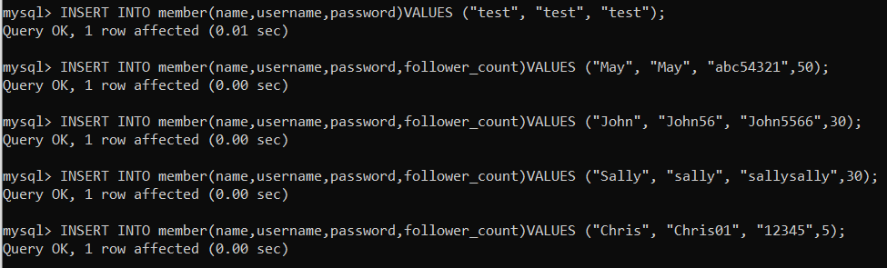

- 使⽤ SELECT 指令取得所有在 member 資料表中的會員資料。
```
select * from member;
```
   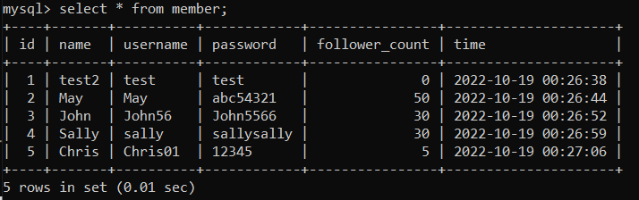

- 使⽤ SELECT 指令取得所有在 member 資料表中的會員資料，並按照 time 欄位，由
近到遠排序。
```
select * from member ORDER BY time DESC;
```
   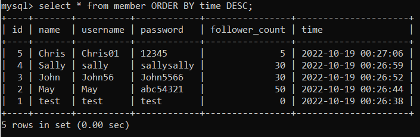

- 使⽤ SELECT 指令取得 member 資料表中第 2 ~ 4 共三筆資料，並按照 time 欄位，
由近到遠排序。 ( 並非編號 2、3、4 的資料，⽽是排序後的第 2 ~ 4 筆資料 )
```
select * from member ORDER BY time DESC LIMIT 1,3;
```
   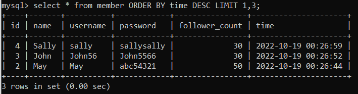

- 使⽤ SELECT 指令取得欄位 username 是 test 的會員資料。
```
select * from member where username="test";
```
   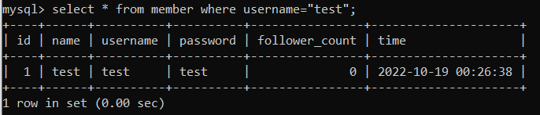

- 使⽤ SELECT 指令取得欄位 username 是 test、且欄位 password 也是 test 的資料。
```
select * from member where username="test" and password="test";
```
   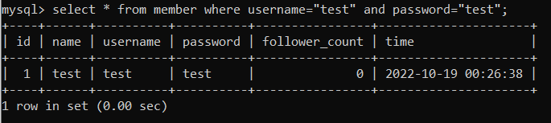

- 使⽤ UPDATE 指令更新欄位 username 是 test 的會員資料，將資料中的 name 欄位改成 test2。
```
UPDATE member SET name="test2" WHERE username="test";
```
   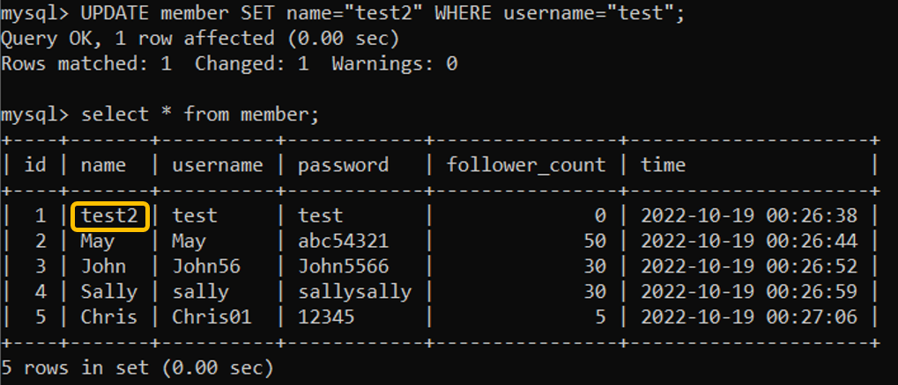

## Requirement 4
- 取得 member 資料表中，總共有幾筆資料 (幾位會員)。
```
SELECT COUNT(id) FROM member;
```
   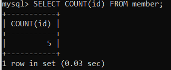

- 取得 member 資料表中，所有會員 follower_count 欄位的總和。
```
SELECT sum(follower_count) FROM member;
```
   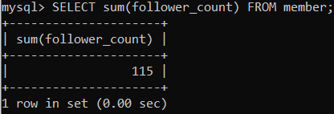

- 取得 member 資料表中，所有會員 follower_count 欄位的平均數。
```
SELECT avg(follower_count) FROM member;
```
   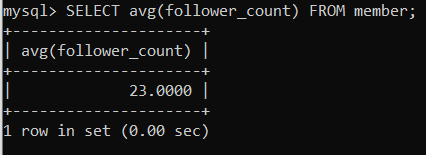

## Requirement 5
- 在資料庫中，建立新資料表紀錄留⾔資訊，取名字為 message 。
```
CREATE TABLE message (
    id bigint PRIMARY KEY AUTO_INCREMENT,
    member_id bigint NOT NULL,
    content varchar(255) NOT NULL,
    like_count int unsigned NOT NULL DEFAULT 0,
    time datetime NOT NULL DEFAULT CURRENT_TIMESTAMP,
    FOREIGN KEY(member_id) REFERENCES member(id)
);

INSERT INTO message(member_id,content)VALUES (2, "It's a rainy day!");
INSERT INTO message(member_id,content,like_count)VALUES (1, "It's hard to go to bed early~~",6000);
INSERT INTO message(member_id,content,like_count)VALUES (1, "The weather was suitable for sleep.",56);
INSERT INTO message(member_id,content,like_count)VALUES (3, "I like autumn~",66);
INSERT INTO message(member_id,content,like_count)VALUES (4, "My umbrella turned inside out!",55);
INSERT INTO message(member_id,content,like_count)VALUES (5, "I like to lie in bed and watch Japanese TV dramas.",3000);
INSERT INTO message(member_id,content,like_count)VALUES (5, "This apple is delicious.",2000);
```
   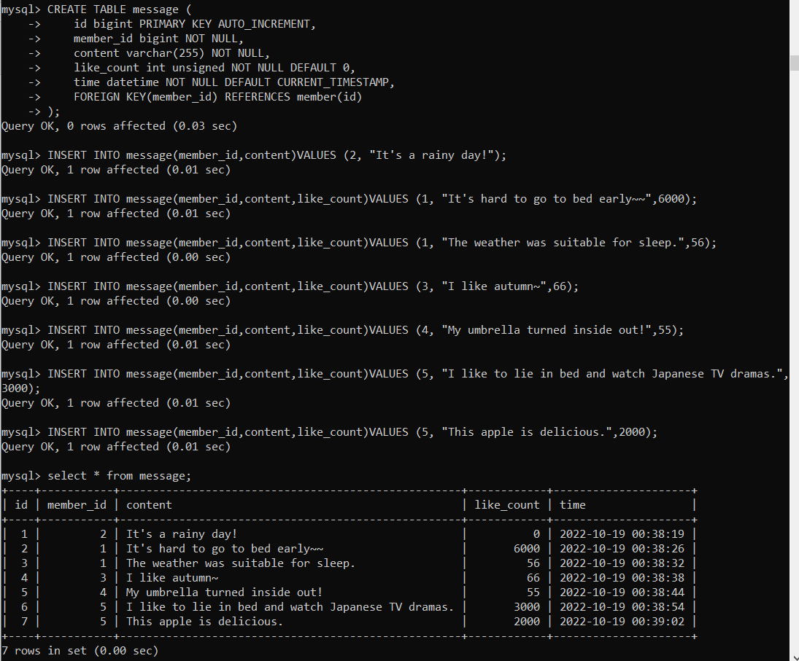

- 使⽤ SELECT 搭配 JOIN 語法，取得所有留⾔，結果須包含留⾔者會員的姓名。
```
SELECT member.id,member.name,member.username,message.content,message.like_count,message.time FROM message INNER JOIN member ON message.member_id=member.id;
```
   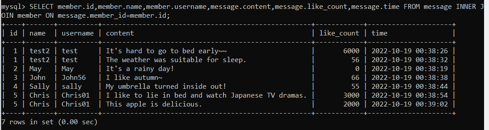

- 使⽤ SELECT 搭配 JOIN 語法，取得 member 資料表中欄位 username 是 test 的所有
留⾔，資料中須包含留⾔者會員的姓名。
```
SELECT member.id,member.name,member.username,message.content,message.like_count,message.time FROM message INNER JOIN member ON message.member_id=member.id where member.username="test";
```
   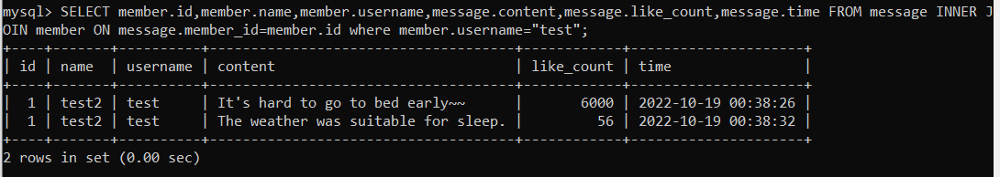

- 使⽤ SELECT、SQL Aggregate Functions 搭配 JOIN 語法，取得 member 資料表中
欄位 username 是 test 的所有留⾔平均按讚數。
```
SELECT avg(message.like_count) FROM message INNER JOIN member ON message.member_id=member.id where member.username="test";
```
   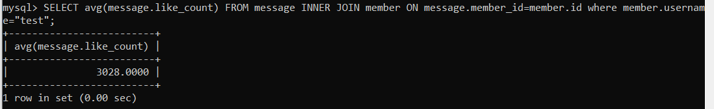

## (Optional) Requirement 6
- 不只要記錄留言按讚的數量，還要紀錄每一個留言的按讚會員是誰

| 欄位名稱  | 資料型態 | 額外設定 | ⽤途說明 |
|  :---:  |  :---:  |  :---:  |  :---:  |
| id | bigint | 主鍵、⾃動遞增 | 獨立編號 |
| member_id | bigint | 不可為空值、外鍵對應 member 資料表中的 id | 按讚會員編號 |
| message_id | bigint | 不可為空值、外鍵對應 message 資料表中的 id | 留言內容編號 |
| time | datetime | 不可為空值、預設為當前時間 | 按讚時間 |
```
CREATE TABLE likeDetails (
    id bigint PRIMARY KEY AUTO_INCREMENT,
    message_id bigint NOT NULL,
    member_id bigint NOT NULL,
    time datetime NOT NULL DEFAULT CURRENT_TIMESTAMP,
    FOREIGN KEY(message_id) REFERENCES message(id),
    FOREIGN KEY(member_id) REFERENCES member(id)
);
```
   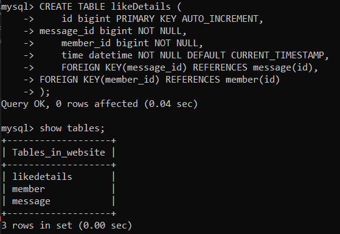
- 可以根據留言編號取得該留言有哪些會員按讚。
```
例子: 對第二條留言按讚的會員
select member.name,member.username from likeDetails inner join member on likeDetails.member_id=member.id 
where likeDetails.message_id=2;
```
   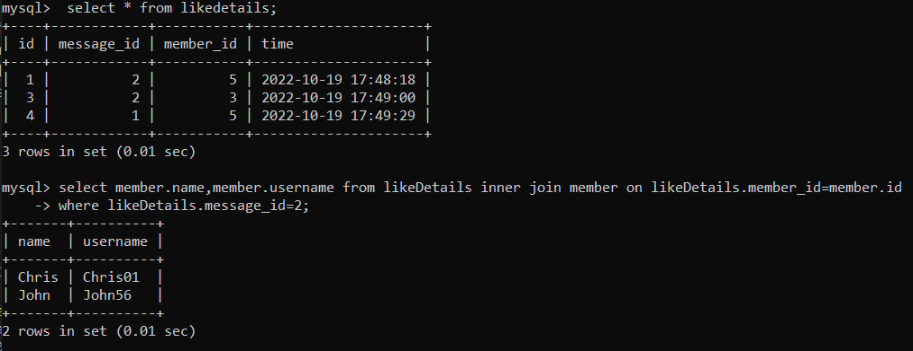
- 會員若是嘗試對留言按讚：要能先檢查是否曾經按過讚，然後才將按讚的數量 +1 並且記錄按讚的會員是誰。
```
1.確認第2位會員對第2條留言按讚數是0:
select count(*) from likeDetails where member_id=2 and message_id=2;
2.再允許第2位會員對第2條留言按讚，並加這個動作加入資料表中:
insert into likeDetails(message_id, member_id) values(2,2);
```
   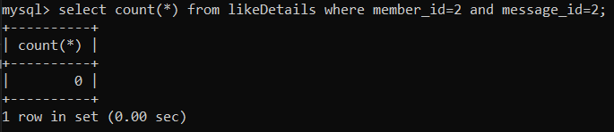
   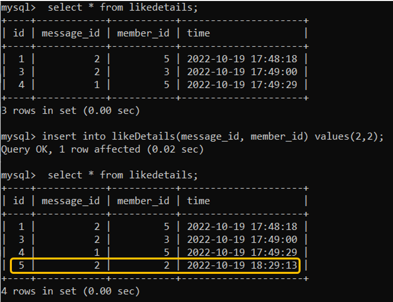